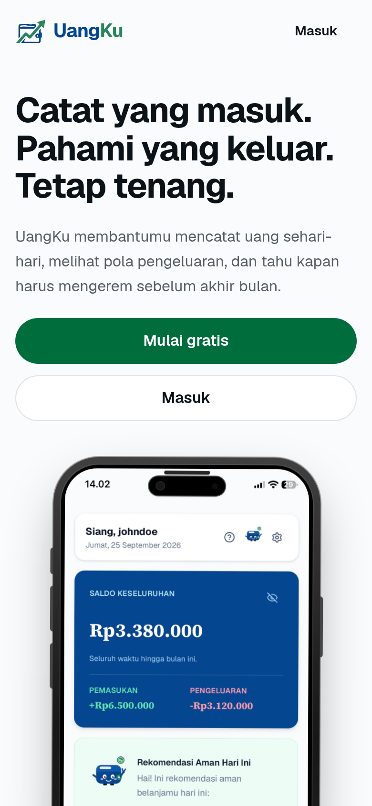
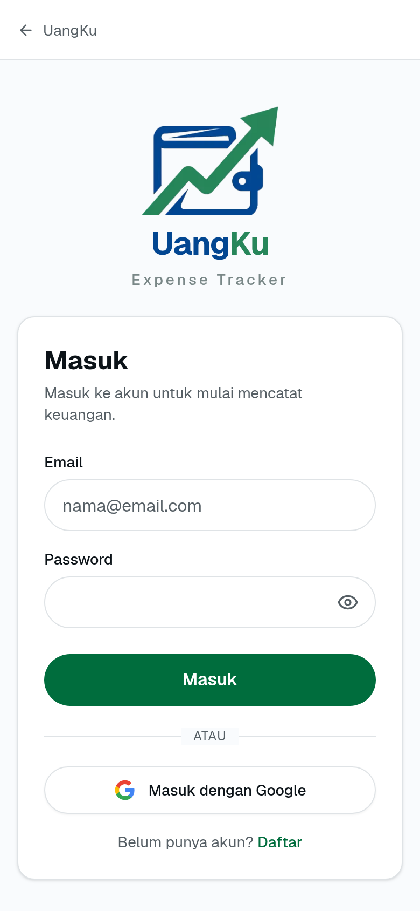
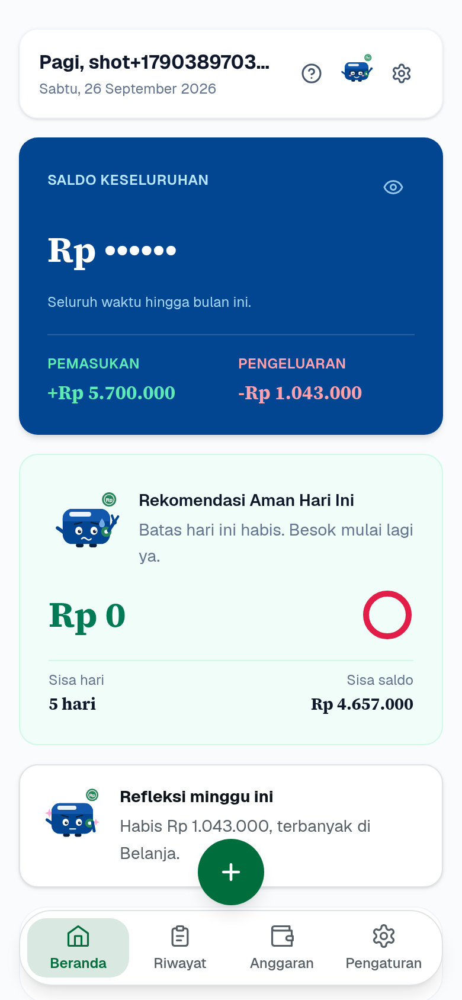
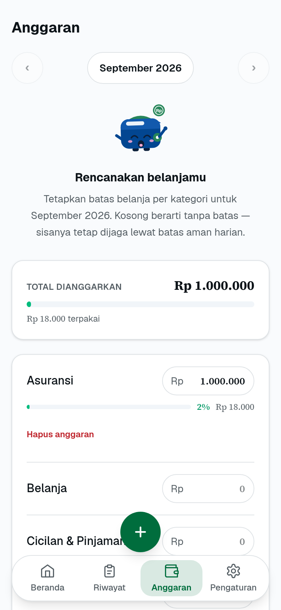

# UangKu

Production-ready personal finance tracker for daily income and expenses — live at https://uangku-web.my.id.

[](https://uangku-web.my.id)


| Landing | Login |
|---|---|
|  |  |

| Dashboard | Budgets |
|---|---|
|  |  |

## Highlights

- Live in production: Next.js on Vercel + FastAPI on Render + custom domain with SSL.
- Auth: server-side sessions (httpOnly, 7-day) plus Google OAuth 2.0 with automatic account linking.
- Tested: 323 pytest + 177 Vitest + Playwright E2E, with Ruff and ESLint gates.
- Budgets per category with 75%/90% usage warnings and safe month navigation.
- Server-side recurring reminders (manual confirm, idempotent per month) synced across devices.
- Dashboard summary with formatted PDF / CSV export; mobile-first installable PWA.

## Stack

- **Client**: Next.js 16, React 19, TypeScript 5, Tailwind CSS 4
- **Server**: FastAPI 0.141, SQLAlchemy 2, Pydantic 2, PostgreSQL 16, Alembic
- **Auth**: server-side sessions (signed cookie, Argon2 password hashing)
- **Testing**: pytest (server), Vitest (client)
- **Tooling**: mise (dev environment), Ruff (Python lint), ESLint (client lint)

## Features

- Email registration/login with server-side sessions
- Income & expense transactions (create, update, delete, filter, paginate)
- Categories per type (income/expense) with ownership isolation; transactions
  can be bulk-moved to another category before deleting a used one
  (`POST /api/v1/categories/{id}/transfer`); the last category of a type
  cannot be deleted
- Monthly budgets per category with 75%/90% usage warnings; deletion is
  explicit with confirmation (clearing the input only cancels the edit);
  month navigation (‹ ›) appears once a budget exists and stops at the
  first budget's month — months before it are not browsable; past months
  show only budgeted categories (no empty forms); auto-refresh on
  transaction changes
- Online-only mutation flows: network failures show a clear retryable error
  and are never queued on the device; the server is the single source of truth
- Global toast notifications (success/error/info) for user feedback
- Monthly recurring transaction reminders (server-side, synced across devices):
  edit, pause/resume, income or expense, manual confirm (one transaction/month)
- Onboarding tour + Mochi mascot guide (personal finance agent)
- Indicator Spotlight Tour: interaktif menyorot metrik utama Beranda (Safe-to-Spend, Saldo Keseluruhan vs Sisa Saldo Aman, Status Anggaran, Streak) dengan cutout fokus jernih bebas blur
- Monthly Wrap-up & Evaluasi Mochi: kilas balik finansial bulanan dengan rasio tabungan, kategori belanja teratas, skor kepatuhan anggaran, narasi evaluasi cerdas Mochi, dan salin ringkasan teks berformat
- Halaman Anggaran Teroptimasi: render instan tanpa flicker, debounced autosave 400ms, bottom sheet interaktif, dan navigasi bulan aman
- Dashboard monthly summary; export as formatted PDF (2.000-row cap) or CSV
- Mobile-first UI with bottom navigation

## Prerequisites

- `mise` (manages Node.js 24, Python 3.13, PostgreSQL — see `mise.toml`)
- PostgreSQL running locally with databases `uangku` and `uangku_test`

## Setup

```sh
mise install
cp server/.env.example server/.env   # adjust if needed, never commit .env
createdb uangku
createdb uangku_test
cd server && uv run alembic upgrade head && cd ..
mise run dev
```

Client: http://localhost:3000
Server: http://localhost:8000
API docs: http://localhost:8000/docs
Health: http://localhost:8000/health

The client proxies `/api/*` to the server via Next.js rewrites
(`SERVER_URL`, see `client/next.config.ts`), so no CORS setup is needed.

## Commands

```sh
mise run dev     # client + server together
mise run test    # server pytest + client vitest
mise run lint    # server ruff + client eslint
mise run build   # client production build
mise run test:e2e  # Playwright E2E (butuh dev server running)
```

Direct equivalents:

```sh
cd server && uv run pytest && uv run ruff check .
cd client && npm test && npm run lint && npm run build
cd client && npx playwright test        # E2E
cd client && npx playwright install     # install browsers (first time)
```

## Environment variables

| Variable | Example | Notes |
|---|---|---|
| `DATABASE_URL` | `postgresql+psycopg://.../uangku` | dev database |
| `DATABASE_URL_TEST` | `postgresql+psycopg://.../uangku_test` | pytest database |
| `SECRET_KEY` | random string, min 32 chars | **required in production** (`APP_ENV=production` refuses default and enforces min 32 chars) |
| `HTTPS_ONLY` | `false` | must be `true` in production (enforced) or session cookies go over HTTP |
| `SERVER_URL` | `http://localhost:8000` | client env (`client/.env.local`, see `client/.env.example`), rewrite target (server-side only) |
| `APP_ENV` | `development` | set `production` in prod to enable guards |
| `TRUSTED_PROXY_IPS` | `10.0.0.1` | comma-separated IPs of trusted reverse proxies; enables `X-Forwarded-For` reading for rate limiting. Loopback peers are always trusted. Catatan: di belakang proxy terkelola (Render/Vercel) peer bukan loopback dan IP-nya dinamis — semua user berbagi satu bucket rate-limit; untuk skala keluarga tidak masalah |
| `GOOGLE_CLIENT_ID` | `...apps.googleusercontent.com` | Client ID OAuth 2.0 dari Google Cloud Console (kosong = nonaktif) |
| `GOOGLE_CLIENT_SECRET` | `GOCSPX-...` | Client Secret OAuth 2.0 dari Google Cloud Console |
| `GOOGLE_REDIRECT_URI` | `http://localhost:3000/api/v1/auth/google/callback` | (Opsional) Override redirect URI callback Google |

## Architecture

- `client/src/` — Next.js App Router (`app/`), reusable components (`components/`), API clients (`lib/`)
- `server/app/` — FastAPI app: `api/v1/` (HTTP layer), `services/` (business logic), `schemas/` (Pydantic validation), `models/` (SQLAlchemy), `core/` (config, deps, domain errors)
- `server/tests/` — pytest suite (API + service level, per-user isolation)
- `server/migrations/` — Alembic migrations
- `docs/` — architecture, ERD, product brief, maintenance runbook

Error contract: services raise typed `DomainError`s (`app/core/errors.py`);
the API layer maps them to a stable JSON shape: `{"error": {"code": ..., "message": ...}}`.
Authorization rule: every query is scoped to `current_user.id` — resource IDs
from the client are never trusted for ownership.


## Login dengan Google (OAuth 2.0)

Uangku mendukung autentikasi Google (OAuth 2.0 Authorization Code Flow). Pengguna baru yang mendaftar via Google otomatis dibuatkan akun dengan kategori default. Jika pengguna sudah memiliki akun email/password sebelumnya, akun akan otomatis ditautkan saat masuk menggunakan Google.

### Langkah Konfigurasi Google Cloud Console:

1. Buka [Google Cloud Console](https://console.cloud.google.com/) dan buat project baru (misal: `uangku-app`).
2. Masuk ke menu **APIs & Services** > **OAuth consent screen**:
   - Pilih tipe pengguna **External** lalu klik **Create**.
   - Isi nama aplikasi (misal: `Uangku`), email dukungan pengguna, dan email kontak pengembang.
   - Di bagian **Scopes**, pastikan scope dasar tersedia: `.../auth/userinfo.email`, `.../auth/userinfo.profile`, `openid`.
   - Di bagian **Test users** (jika masih status Testing), tambahkan alamat email Google yang akan digunakan untuk pengujian.
3. Masuk ke menu **APIs & Services** > **Credentials**:
   - Klik **Create Credentials** > **OAuth client ID**.
   - Pilih Application type: **Web application**.
   - Masukkan nama client (misal: `Uangku Web Client`).
    - Pada **Authorized JavaScript origins**, tambahkan:
      - Development: `http://localhost:3000`
      - Production: `https://uangku-web.my.id`
    - Pada **Authorized redirect URIs**, tambahkan:
      - Development: `http://localhost:3000/api/v1/auth/google/callback`
      - Production: `https://uangku-web.my.id/api/v1/auth/google/callback`
4. Salin nilai **Client ID** dan **Client Secret**, lalu masukkan ke `server/.env`:
   ```env
   GOOGLE_CLIENT_ID=your-google-client-id.apps.googleusercontent.com
   GOOGLE_CLIENT_SECRET=your-google-client-secret
   ```
5. Restart backend server FastAPI. Tombol "Masuk dengan Google" dan "Daftar dengan Google" akan langsung berfungsi.
## Production notes

- Set `APP_ENV=production`, a strong `SECRET_KEY`, and `HTTPS_ONLY=true`.
- Set `TRUSTED_PROXY_IPS` to the IP(s) of your reverse proxy (e.g. Nginx/Cloudflare) so rate limiting correctly identifies individual clients behind the proxy. Without this, all users share the same rate-limit bucket.
- Run `alembic upgrade head` on deploy; never edit applied migrations.
  Wajib: tanpa ini, query transaksi/dashboard gagal total (mis. kolom
  `is_opening_balance` tidak ada di DB) dan semua halaman tampil
  "Gagal memuat data". Cek dengan `alembic current` — harus di head terbaru.
- Auth endpoints (`/api/v1/auth/register`, `/api/v1/auth/login`) are rate-limited
  in-app to 5 requests/minute per IP (SlowAPI); export to 30/minute and
  dashboard/transaction-list to 60/minute. Storage is in-memory per process —
  for multi-worker production, switch the limiter to Redis (see
  `server/app/core/rate_limit.py`). For defense in depth, also put
  login/register behind reverse-proxy rate limiting (e.g. nginx `limit_req`)
  in production.
- Session cookies are `httpOnly`, `SameSite=lax`, and expire after 7 days
  (cookie `Max-Age` + absolute `issued_at` cap enforced server-side; logout
  clears the server-side session). Deploying this change logs out all existing
  sessions once (forced re-login).
- Transaction dates are validated server-side: at most tomorrow (payday
  tolerance) and year >= 2000 (422 otherwise); the client mirrors the rule
  with Indonesian messages.
- Unhandled server errors return a stable envelope (`INTERNAL_ERROR` 500,
  `SERVICE_UNAVAILABLE` 503) with the traceback logged server-side only —
  never leaked to clients.
- The app is online-only: when the API is unreachable, mutations fail with a
  clear error and are not queued or auto-retried; the server remains the
  source of truth.
- Recurring reminders are server-side monthly templates synced across devices.
  They never create a transaction automatically: the user must confirm each due
  reminder (manual confirmation, idempotent per month).
- See `docs/architecture.md`, `docs/erd.md`, and `docs/product-brief.md` for deeper design docs.

## Production Readiness & Deployment

Arsitektur produksi saat ini (2026-09):

```text
Pengguna (Browser / Mobile PWA)
      │ HTTPS
      ▼
uangku-web.my.id ──► Vercel (frontend Next.js)
      │  rewrite /api/* ──► Render (backend FastAPI: uangku-api.onrender.com)
      │                         │  SSL (?sslmode=require)
      │                         ▼
      │                    PostgreSQL produksi
      ▼
DNS: Idwebhost (NS1/NS2.IDWEBHOST.ID) → A @ 216.198.79.1,
     CNAME www → <id>.vercel-dns-017.com (lihat Vercel Domains)
```

- **Frontend**: project Vercel `uangku`, Root Directory `client`, auto-deploy
  dari branch `master`. Custom domain `uangku-web.my.id` (apex = Production,
  `www` + `uangku-website.vercel.app` redirect 308 ke apex).
- **Backend**: service Render `uangku-api` (Docker dari `server/Dockerfile`),
  auto-deploy dari branch `master`. `entrypoint.sh` menjalankan
  `alembic upgrade head` otomatis tiap deploy (`RUN_MIGRATIONS=true`).
- **Detail operasional** (env produksi, domain, runbook insiden, jadwal
  rutin): lihat `docs/maintenance.md`.

### Production Checklist
1. **Environment Variables** (Render → Environment; Vercel → Settings):
   - Backend (Render): `APP_ENV=production`, `SECRET_KEY` (acak, min 32 char),
     `HTTPS_ONLY=true`, `DATABASE_URL` (pakai `?sslmode=require`),
     `ALLOWED_ORIGINS=https://uangku-web.my.id`,
     `GOOGLE_CLIENT_ID` + `GOOGLE_CLIENT_SECRET`.
   - Frontend (Vercel): `SERVER_URL=https://uangku-api.onrender.com`
     (target rewrite `/api/*`, server-side only).
2. **Database Migrations**: otomatis via `entrypoint.sh` saat deploy backend;
   verifikasi di log Render (`Migrations complete.`).
3. **Verification Gate**:
   ```bash
   mise run test    # server pytest + client vitest
   mise run lint    # Ruff & ESLint
   mise run build   # Next.js production build
   ```
