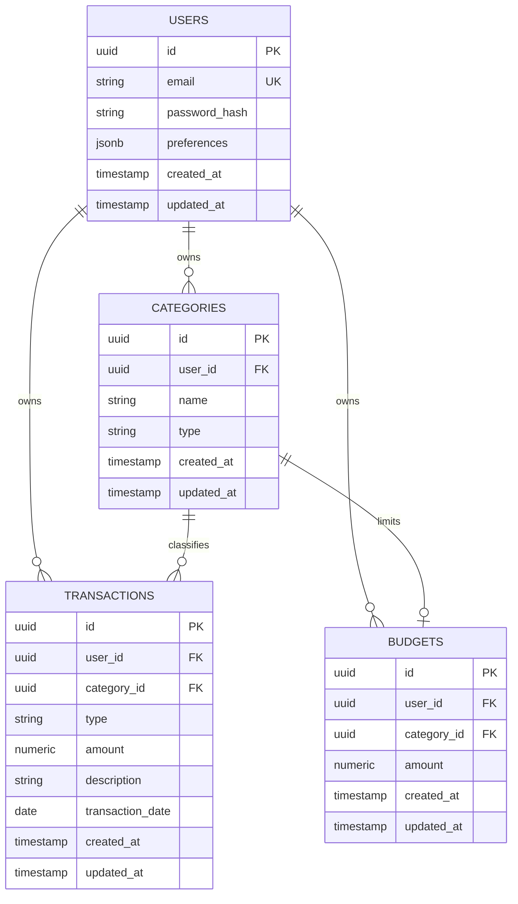

# UangKu — Entity Relationship Diagram

## Overview

UangKu v1 menggunakan empat entity utama:

- User
- Category
- Transaction
- Budget

Setiap data keuangan harus dimiliki oleh user tertentu agar data antar pengguna tetap terisolasi.

## User

Menyimpan akun pengguna.

Fields:

- `id` — UUID, primary key
- `email` — string, unique, required
- `password_hash` — string, required
- `preferences` — JSONB, required (default `{}`); kunci opsional:
  `payday` (1–31), `onboarding_done` (bool, status tur Mochi),
  `tx_sources`, `debt_tags`, `templates`
- `created_at` — timestamp
- `updated_at` — timestamp

Relationships:

- satu User memiliki banyak Category
- satu User memiliki banyak Transaction
- satu User memiliki banyak Budget

## Category

Menyimpan kategori pemasukan atau pengeluaran.

Fields:

- `id` — UUID, primary key
- `user_id` — UUID, foreign key ke User
- `name` — string, required
- `type` — `income` atau `expense`
- `created_at` — timestamp
- `updated_at` — timestamp

Constraint:

Kombinasi berikut harus unik:

`user_id + name + type`

Artinya satu user boleh memiliki:

- `Lainnya` untuk income
- `Lainnya` untuk expense

tetapi tidak boleh memiliki dua kategori expense bernama `Makanan`.

## Transaction

Menyimpan transaksi keuangan.

Fields:

- `id` — UUID, primary key
- `user_id` — UUID, foreign key ke User
- `category_id` — UUID, foreign key ke Category
- `type` — `income` atau `expense`
- `amount` — numeric/decimal, required
- `description` — string, optional
- `transaction_date` — date, required
- `created_at` — timestamp
- `updated_at` — timestamp

## Relationship Diagram

## Business Rules

1. `amount` harus lebih besar dari `0`.

2. `type` hanya boleh:
   - `income`
   - `expense`

3. Category harus dimiliki user yang sama dengan Transaction.

4. Type Category harus sama dengan type Transaction.

Contoh valid:

`expense → Makanan (expense)`

Contoh tidak valid:

`income → Makanan (expense)`

5. User hanya boleh membaca dan mengubah Category serta Transaction miliknya sendiri.

6. Nilai uang harus disimpan menggunakan PostgreSQL `NUMERIC`, bukan floating-point.

7. `transaction_date` menunjukkan kapan transaksi terjadi.

8. `created_at` menunjukkan kapan record dibuat di UangKu.

9. Email harus unique dan dinormalisasi sebelum disimpan.

10. Category yang masih digunakan Transaction tidak boleh langsung dihapus.

Untuk v1, delete category ditolak jika masih memiliki transaksi terkait.

11. Kombinasi `user_id + category_id` pada Budget harus unik (satu anggaran
    per kategori per user). `amount` harus lebih besar dari `0`.

12. Budget ikut terhapus (CASCADE) jika kategorinya dihapus.

## Budget

Menyimpan batas belanja bulanan per kategori. Berlaku tiap bulan
(recurring).

Fields:

- `id` — UUID, primary key
- `user_id` — UUID, foreign key ke User (RESTRICT)
- `category_id` — UUID, foreign key ke Category (CASCADE)
- `amount` — numeric/decimal, required, harus > 0
- `created_at` — timestamp
- `updated_at` — timestamp

## Default Categories

Saat akun baru dibuat, UangKu dapat membuat kategori default milik user tersebut.

### Expense

- Makanan
- Transportasi
- Belanja
- Hiburan
- Tagihan
- Kesehatan
- Pendidikan
- Lainnya

### Income

- Gaji
- Freelance
- Bonus
- Penjualan
- Lainnya

## Future Schema

Belum masuk v1:

- wallet/account
- recurring transaction
- financial goal
- shared account
- bank account integration

Schema tersebut baru ditambah melalui migration jika memang dibutuhkan setelah v1 digunakan.
